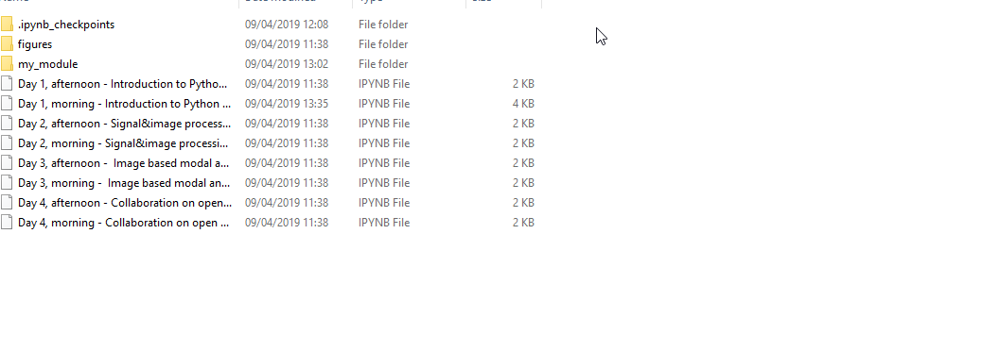

# sdPy
Structural Dynamics with Python

This repository contains the course material for the "High-speed Image Based Experimental Modal Analysis &amp; Open Source Tools" online course.


# How to follow the course

The course material is organised into two interactive Notebooks, where the participants can actively follow the instructors' examples, as well as explore the provided source code.

In this repository, a [Jupyter Notebooks](https://jupyter.org/) template is provided for each planned activity. These are interactive documents, that contain useful information and written instructions, as well as runnable source code for the examples provided by the instructors.

These templates should be [downloaded](#download) to your machine prior to the courses, where they will serve as a guide for our work, as well as a convenient way for you to take notes.


# <a name="download"></a>How to download the course material

You can download the whole repository as a .zip archive by clicking the "Clone or download" button on the top right. 

<a name="clone"></a>If you have already [installed the required software](#install), you can set up your local repository, linked directly to this online source, by using the following command:

```cmd
$ git clone https://github.com/ladisk/sdPy.git
```

in a comand prompt / terminal window in your local directory where you want the course material to be saved.

# <a name="install"></a>Installation

To run the Jupyter Notebook templates, provided in this repository, you will need to install the Python programming language, as well as its `jupyter` and `notebook` packages. 

1. The simplest way of doing this is by installing the [Anaconda distribution of Python](https://www.anaconda.com/products/individual#download-section) (select the latest version of Python 3 for your operating system).

    With Anaconda you will also get most of the other Python packages we will be using during this course.

    Once Anaconda is installed, you can open Jupyter Notebook by running the following command in the command prompt / terminal window in your local directory containing the `.ipynb` files:

    ```cmd
    $ jupyter notebook
    ```

    


2. Another tool you might find useful when accessing the course material is the [Git](https://git-scm.com/) version control system.
To start using Git, you should [download](https://git-scm.com/downloads) and install the Git client and [set it up with you user information](https://help.github.com/en/articles/setting-your-username-in-git). You are now ready to [clone](#clone) this repository to your local machine!


# <a name="getting-started"></a>Getting started with Python

After you've installed a distribution of Python it might be useful to get familiar with the Python programming language.

[Scipy lecture notes](http://scipy-lectures.org/index.html) are a great resource for aspiring Python users, focused more on the scientific community.
Sections [1.1](http://scipy-lectures.org/intro/intro.html) and [1.2](http://scipy-lectures.org/intro/language/python_language.html) of Scipy lecture notes will provide more than enough info to get you started.

If you want to learn even more about Python, you will find countless tutorials available online, but the [official Python tutorial](https://docs.python.org/3/tutorial/index.html) is a good place to start.

You can also find many more great resources in the [official Python beginners guide](https://wiki.python.org/moin/BeginnersGuide).

## Python for Matlab users

Many researchers and engineers learning Python come from a background of Matlab or a similar commercial software package. A lot of effort has gone into making this transition as simple as possible.

The [Scipy](https://www.scipy.org/) project includes all the tools required to make Python a powerful alternative to most comercially available numerical packages. If you are an experienced Matlab user, the [NumPy for Matlab users](https://numpy.org/doc/stable/user/numpy-for-matlab-users.html) page contains important information to quickly get you started.


# <a name="online-course"></a>Short course on Python for structural dynamics

Once you're familiar with the basics of Python programming, you can follow our course material using Juypter Notebook:

1. [Open-source Python tools for structural dynamics](Part%201%20-%20Open-source%20Python%20tools%20for%20structural%20dynamics.ipynb)

2. [High-speed based EMA powered by open-source Python tools](Part%202%20-%20High-speed%20based%20EMA%20powered%20by%20open-source%20Python%20tools.ipynb)